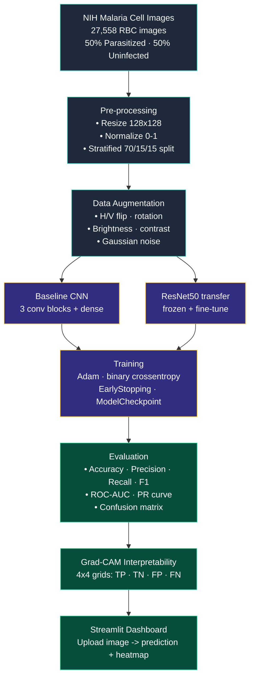

# Project Flow Diagram

UCS321 EST Project — Statement #4 (Biocon Malaria RBC Classification)

## Pre-processing steps

1. **Load** images from `data/raw/cell_images/{Parasitized,Uninfected}/`
2. **Resize** to 128×128 px (square, RGB)
3. **Normalize** pixel values to [0, 1] by dividing by 255
4. **Split** into train/val/test (70/15/15) with stratification on label
5. **Augment** training images: random flips, ±20° rotation, zoom, brightness/contrast jitter, low-amplitude Gaussian noise (addresses "noise" + "variability" in problem statement)

## Visualization steps

- **EDA notebook** — class balance bar plot, image-size histogram, sample image grid (8 of each class), augmented-vs-original comparison
- **Training curves** — loss/accuracy/AUC per epoch for both models
- **Confusion matrix** + **ROC curve** + **Precision-Recall curve** per model
- **Grad-CAM heatmaps** — overlaid on test images to highlight regions the model focuses on
- **Streamlit dashboard** — live prediction + Grad-CAM overlay for any uploaded image
